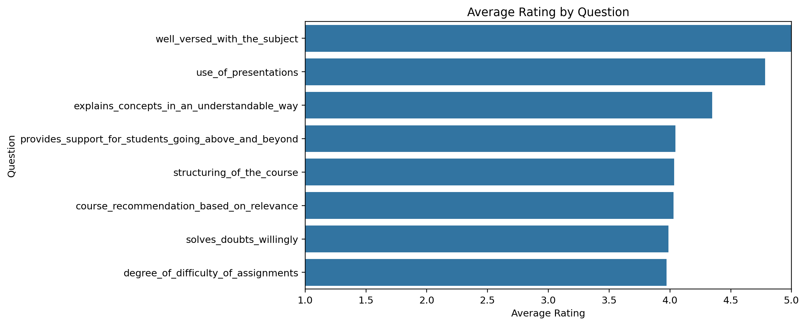
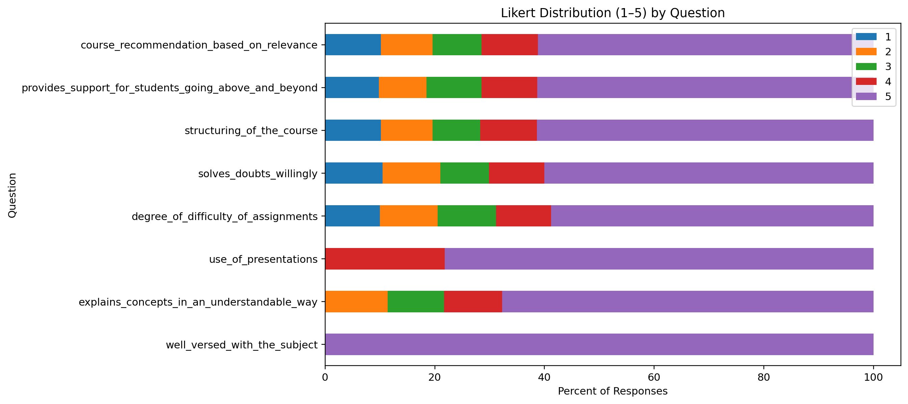
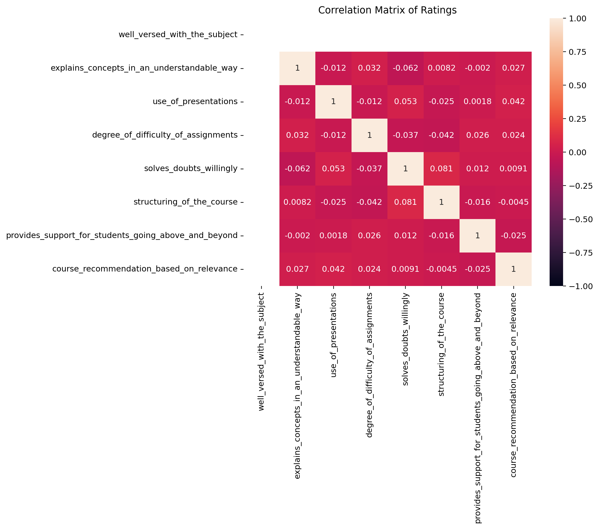
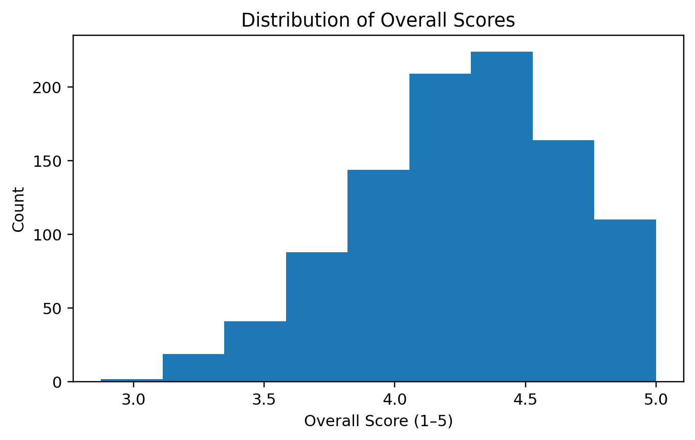

# FUTURE_DS_03

Here’s a clean, professional **README.md** you can paste into your repo:

---

# College Event Feedback Analysis – Internship Project (Task 3)

Turn raw student survey responses into clear, actionable insights for event/course improvement.
This is my **final internship task (Task 3)** where I built an end-to-end analysis workflow in **Google Colab** using Python.

---

## 📌 Objectives

* Clean and transform Likert-scale survey data (1–5).
* Compute key KPIs (overall satisfaction, %≥4 ratings, recommendation rate).
* Visualize results with clear, presentation-ready charts.
* Prepare a cleaned dataset for dashboards (e.g., Power BI).

---

## 🧰 Tech Stack

* **Python** (Google Colab / Jupyter)
* **pandas**, **numpy**
* **matplotlib**, **seaborn**
* *(Optional)* **NLTK VADER**, **wordcloud** for text sentiment if a comments field is added later.

---

## 📂 Repository Structure

```
.
├── COLLEGE_EVENT_FEEDBACK_ANALYSIS_–_INTERNSHIP_PROJECT.ipynb  # Main notebook
├── student_feedback.csv                                        # Raw dataset (CSV)
├── avg_by_question.png                                         # Viz 1
├── likert_stacked.png                                          # Viz 2
├── corr_heatmap.png                                            # Viz 3
├── overall_score_dist.png                                      # Viz 4
└── README.md
```

---

## 🗂️ Data Dictionary (columns used)

* `student_id` – unique respondent identifier (if available)
* `well_versed_with_the_subject`
* `explains_concepts_in_an_understandable_way`
* `use_of_presentations`
* `degree_of_difficulty_of_assignments`
* `solves_doubts_willingly`
* `structuring_of_the_course`
* `provides_support_for_students_going_above_and_beyond`
* `course_recommendation_based_on_relevance`

> All question columns are Likert scale (1 to 5).
> If you add a **comments/feedback** free-text column, the notebook will also run **sentiment analysis**.

---

## 🚀 Quick Start

### Option A — Run in Google Colab

1. Open the notebook:
   `COLLEGE_EVENT_FEEDBACK_ANALYSIS_–_INTERNSHIP_PROJECT.ipynb`
2. Runtime → Run all.
   The notebook:

   * Normalizes headers
   * Converts Likert responses to numeric
   * Calculates KPIs
   * Generates and saves charts (`.png`)
   * Exports a cleaned CSV for dashboarding

### Option B — Run locally

```bash
python -m venv .venv
source .venv/bin/activate   # Windows: .venv\Scripts\activate
pip install -r <(echo "pandas\nnumpy\nmatplotlib\nseaborn\nnltk\nwordcloud")
jupyter notebook
```

Open the notebook and run all cells.

---

## 📈 Key Outputs

### Visualizations

* **Average Rating by Question**
  

* **Likert Distribution (1–5) by Question**
  

* **Correlation Matrix of Ratings**
  

* **Distribution of Overall Scores**
  

### KPIs (computed in notebook)

* Total responses
* Overall satisfaction score (mean of all questions)
* % of responses with overall score **≥ 4**
* Recommendation **% (4–5)** if a recommendation field exists

---

## 🔎 Findings (from this dataset)

* **Top strengths** (highest average ratings):
  `well_versed_with_the_subject`, `use_of_presentations`,
  `explains_concepts_in_an_understandable_way`
* **Focus areas** (relatively lower averages):
  `degree_of_difficulty_of_assignments`, `solves_doubts_willingly`
* **Drivers**: The correlation heatmap helps identify which factors are most associated with recommendation.

> Exact numbers may vary if you replace/extend the dataset. Re-run the notebook to regenerate insights.

---

## 🧪 Extend the Project

* Add a free-text **comments** question to your form. The notebook will:

  * run **VADER sentiment analysis**,
  * create a **word cloud**,
  * and plot **text sentiment distribution**.
* Connect the cleaned CSV to **Power BI** to build a live dashboard.

---

## 🙌 Acknowledgment

This project was completed as **Task 3 (Final)** of my internship.
Thanks to my mentors and team for guidance and feedback throughout the journey.
